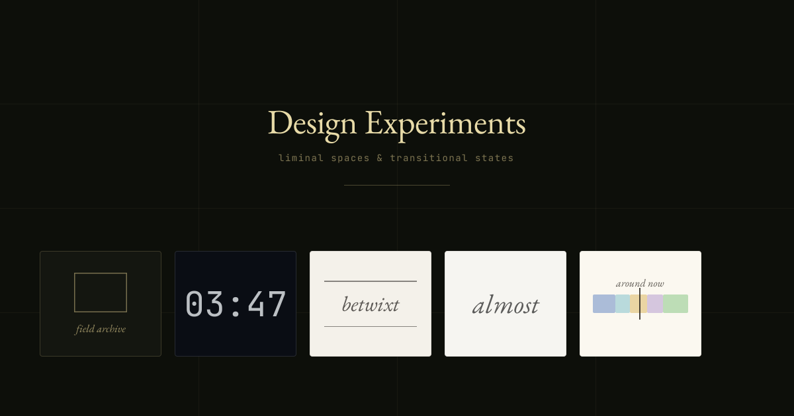

# Design Experiments

> Liminal spaces & transitional states — interactive concepts that live in the in-between.

[**Live showcase ↗**](https://ajmeese7.github.io/design-experiments/)



A small archive of single-page design studies, each one trying to capture a
specific kind of in-between: nocturnal, anonymous, archival, suspended. No
build step, no framework lock-in — every experiment is one self-contained
HTML file that boots React from a CDN. Open it, read it, copy what you like.

---

## The experiments

### [Backrooms — Field Archive](liminal-space/Backrooms.html)

An SCP-style index of transitional interiors submitted anonymously. Case
files, redacted log entries, and a slow scroll through rooms that probably
shouldn't exist.

> *Direction:* SCP archive · *Palette:* dark · *Flow:* `index → file → log`

### [3:47 AM](<liminal-space/3-47 AM.html>)

A nocturnal feed: thoughts left behind between three and five in the
morning, when the door is open. Outside that window, the room is empty.
The full app version lives at [347am.ajmeese7.workers.dev](https://347am.ajmeese7.workers.dev).

> *Direction:* nocturnal feed · *Palette:* dark · *Flow:* live clock + feed

### [Betwixt](liminal-space/Betwixt.html)

A literary editorial. Essays from the unnamed rooms in a life — table of
contents to reading view, all set in EB Garamond on warm paper.

> *Direction:* literary editorial · *Palette:* light · *Flow:* `toc → read`

### [Buffer — An Indefinite Wait](liminal-space/Buffer.html)

The content you came for will not arrive. That is the content. A loading
state that has decided, on its own, to be the destination.

> *Direction:* digital liminality · *Palette:* light · *Flow:* stuck progress bar

### [FlowCal — daily orientation for ADHD](adhd-calendar/)

Soft time windows, never rigid blocks. An interactive demo of a calendar
that bends when the day does — gentle rebalancing when you spend longer
than planned, and a single "around now" view so the day always has a
shape without locking you into one.

> *Direction:* ADHD time design · *Palette:* warm paper · *Flow:* `live clock → soft windows → rebalance`

---

## Running it

The whole repository is the live site. Anything works:

```sh
# any static server, e.g.
npx serve .
# or just
open index.html
```

GitHub Pages serves it directly from `main`.

## Project layout

```
design-experiments/
├── index.html              # gallery + overlay router (deep-linked via #slug)
├── liminal-space/          # one self-contained HTML per liminal-space concept
├── adhd-calendar/          # FlowCal — interactive multi-file demo
├── og-image.png            # social preview (generated)
├── og-image.svg            #   (generated)
└── scripts/                # SVG → PNG OG-image pipeline
```

### Regenerating the social card

```sh
npm install
npm run build:og
```

`og-image.{svg,png}` are written to the repo root. Fonts are committed
under `assets/fonts/` so the rendering is deterministic.

## Stack

- Vanilla HTML + CDN React 18 + Babel Standalone — zero install, view-source friendly
- [EB Garamond](https://github.com/octaviopardo/EBGaramond12) +
  [JetBrains Mono](https://github.com/JetBrains/JetBrainsMono) for type
- [satori](https://github.com/vercel/satori) + [sharp](https://github.com/lovell/sharp) for the OG image pipeline
- Hosted on GitHub Pages

## Design notes

Each experiment shares a small palette of aesthetic decisions but commits
to its own world:

- **One direction per file.** The HTML name is the experiment name; the
  React entrypoint is `<NameDirection />`.
- **Type does the work.** Layouts lean on EB Garamond italics and
  letterspaced JetBrains Mono caps before any decoration.
- **Deep-linkable.** The gallery's overlay router updates the URL hash
  (`#backrooms`, `#3-47am`, `#flowcal`, …) so any concept is shareable.
- **Self-contained.** Each experiment can be lifted out of the repo and
  hosted on its own (single HTML for the liminal-space pieces; a small
  folder for FlowCal).

## Inspiration

The set is loose homage to liminal-space communities, the [SCP Foundation](https://scp-wiki.wikidot.com/),
the [hauntology revival](https://en.wikipedia.org/wiki/Hauntology), and
generally the kind of UI that feels like it was found, not designed.
